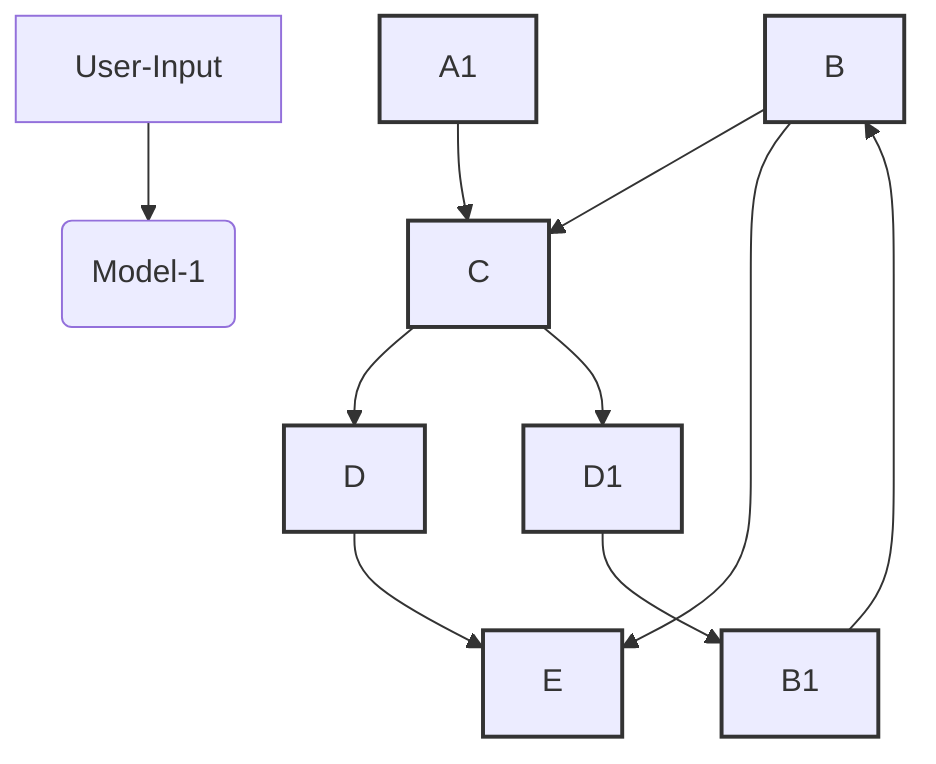

# LUCI
LLM Unified Controller In-person. LUCIfer, the potential job eater.

# **Project LUCI: AI-Assisted Project Development Platform**

## **Overview**
Project LUCI is an innovative web platform designed to revolutionize project development through AI-assisted automation and intelligent decision-making. It allows users to create, manage, and optimize projects using AI instances with memory, vision, and automation capabilities. Each project is treated as a standalone entity, ensuring tailored assistance.

The system integrates:
1. **Decision-making and task decomposition** (LLaMA - Model 1).
2. **Code understanding and context detection** (Watcher - Model 2).
3. **Automation and control** (Controller - Model 3).

## **Key Features**
- AI instances per project with persistent memory.
- Integration of computer vision for project understanding and automation.
- File I/O, directory management, and code generation/modification capabilities.
- Two distinct workflows to handle new projects and ongoing developments.

---

## **Workflow**

### **Scenario 1: Starting a New Project or Sub-Part**
1. **User Input**: The user provides a prompt describing the desired feature or project section.
2. **Watcher (Model 1)**:
   - Reads the codebase and gathers contextual information using computer vision.
   - Detects files, directories, and coordinates for operation.
3. **LLaMA (Model 2)**:
   - Processes input and context to make decisions.
   - Generates required code, documentation, or workflows.
4. **Controller (Model 3)**:
   - Executes actions (e.g., file updates, navigation, automation).
   - Ensures all changes are applied effectively.
5. **Frontend Update**:
   - Updates and results are displayed on the user interface.

---

### **Scenario 2: Mid-Journey Assistance**
1. **User Input**: The user initiates a prompt expecting the system to understand the existing workflow.
2. **LLaMA (Model 2)**:
   - Deciphers the context from memory or database.
3. **Controller (Model 3)**:
   - Navigates to the relevant part of the project (e.g., files, code section).
4. **Watcher (Model 1)**:
   - Reads file I/O, text content, and coordinates.
   - Detects areas requiring modification or additional updates.
5. **Scenario 1 Workflow**:
   - The process continues with Scenario 1, ensuring the desired updates are implemented.
6. **Frontend Update**:
   - Results and updates are reflected in real time.

---

## **System Architecture**
The architecture combines three AI models:
- **Model 1 (Watcher)**: Detects and reads codebases, coordinates, and visual data using computer vision.
- **Model 2 (LLaMA)**: Acts as the decision-making core, leveraging natural language understanding and reasoning.
- **Model 3 (Controller)**: Automates tasks, navigates files, and ensures seamless updates.

---

## **High-Level Data Flow Diagram (DFD)**

> The DFD visualizes the flow of data and interactions between the user, AI models, and project files across the two scenarios.

---

## **How It Works**

### **The High-Level Approach**
To overcome these challenges, you can integrate an LLM with a **perception model** (computer vision) and an **action model** (automation tools):

1. **Decision-Making with LLM:**  
   - Use the LLM to decide **what action to take** based on high-level commands.
   - Example: 
     - Input: "I want to compose an email."
     - LLM Output: "Locate the 'Compose' button and click on it."

2. **Screen Understanding with Computer Vision:**  
   - Use a vision model (e.g., YOLO) to locate UI elements like buttons, fields, or menus.

3. **Action Execution:**  
   - Pass the LLM's decision and the vision model's coordinates to an automation tool (e.g., PyAutoGUI) to perform the action.

---

1. **Create a Project**: Users initiate a project via the platform interface.
2. **AI Instance Assignment**: Each project is assigned a dedicated AI instance with memory for personalized assistance.
3. **Codebase Management**: Files and directories are managed dynamically based on user input and AI analysis.
4. **Visual Understanding**: The system integrates computer vision for better understanding of diagrams, UI, and workflows.
5. **Project Execution**: AI instances automate file operations, generate new code, and optimize existing workflows.

---

## **Future Potential**
Project LUCI aims to redefine how developers interact with projects, enhancing productivity through AI-driven intelligence and automation.
